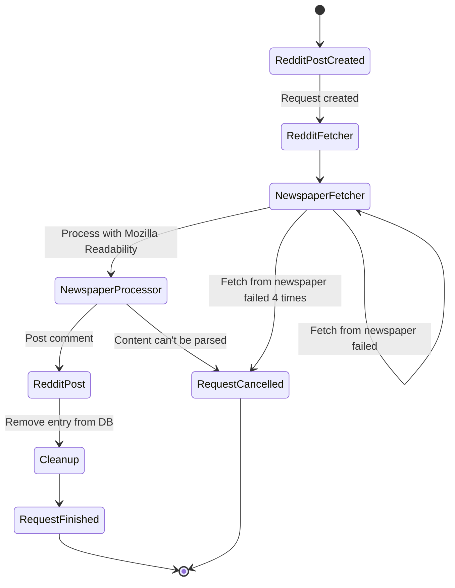

# Post State Transitions

This document outlines how posts move through different states in the system.

## State Flow

1. **Initial State (Reddit Fetch)**
   - Post is created in Reddit by a user
   - `reddit_fetch` discovers the post
   - Post is added to database with:
     - `fetched_at_utc`: NULL
     - `processed_at_utc`: NULL
     - `posted_at_utc`: NULL

2. **Fetch State (Newspaper Fetcher)**
   - `newspaper_fetcher` picks up the post
   - Downloads the article content
   - Stores the raw text in the `texts` table
   - Sets `fetched_at_utc` to current time
   - If a fetch fails 4 times in a row, the request is cancelled

3. **Processing State (Newspaper Processor)**
   - `newspaper_processor` picks up the post
   - Processes content through readability
   - Sets `processed_at_utc` to current time
   - Stores processed text in `texts` table
   - If the content is empty, the request is cancelled

4. **Posting State (Reddit Post)**
   - `reddit_post` looks for posts with `processed_at_utc` set
   - Posts comment to Reddit
   - Sets `posted_at_utc` to current time

5. **Cleanup State**
   - System job runs periodically
   - Deletes posts where `posted_at_utc` is older than 1 day or processed without any text

## Database Schema

The database schema is defined in `infrastructure/database.py`. The schema includes:

- `posts` table: Stores Reddit post information and state timestamps
- `texts` table: Stores processed text content for each post

See the `init_db()` function in `database.py` for the complete schema definition.

## State Transition Diagram

